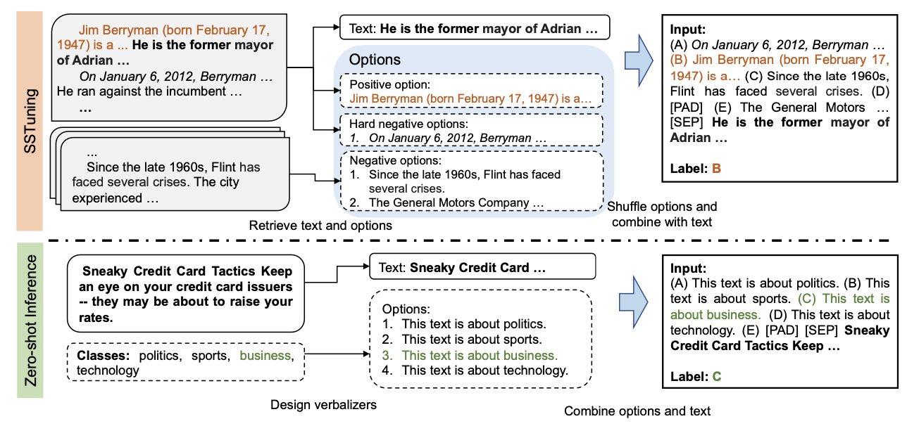
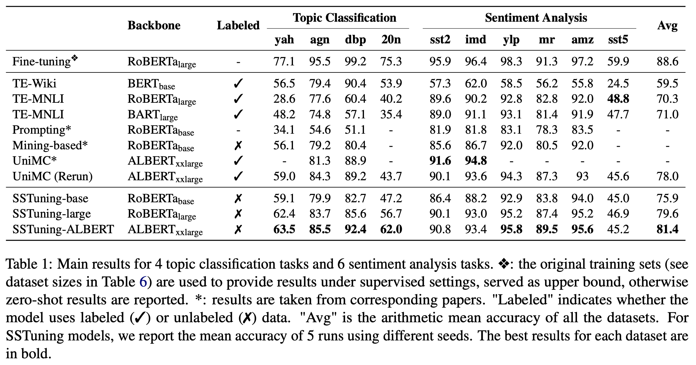

# Zero-Shot Text Classification via Self-Supervised Tuning
This repository contains the code and pre-trained models for the paper "[Zero-Shot Text Classification via Self-Supervised Tuning](https://arxiv.org/abs/2305.11442)", which was accepted to Findings of ACL 2023.

## News
[2023/8/14] 

## Model description
The model is tuned with unlabeled data using a learning objective called first sentence prediction (FSP). 
The FSP task is designed by considering both the nature of the unlabeled corpus and the input/output format of classification tasks. 
The training and validation sets are constructed from the unlabeled corpus using FSP. 



During tuning, BERT-like pre-trained masked language models such as RoBERTa and ALBERT are employed as the backbone, and an output layer for classification is added. 
The learning objective for FSP is to predict the index of the correct label. 
A cross-entropy loss is used for tuning the model.

## Model variations
There are four versions of models released. The details are: 

| Model | Backbone | #params | lang | acc | Speed | #Train
|------------|-----------|----------|-------|-------|----|-------------|
|   [zero-shot-classify-SSTuning-base](https://huggingface.co/DAMO-NLP-SG/zero-shot-classify-SSTuning-base)    |  [roberta-base](https://huggingface.co/roberta-base)      |  125M    | En | Low    |  High    | 20.48M |  
|   [zero-shot-classify-SSTuning-large](https://huggingface.co/DAMO-NLP-SG/zero-shot-classify-SSTuning-large)    |    [roberta-large](https://huggingface.co/roberta-large)      | 355M     | En |   Medium   | Medium | 5.12M |
|   [zero-shot-classify-SSTuning-ALBERT](https://huggingface.co/DAMO-NLP-SG/zero-shot-classify-SSTuning-ALBERT)   |  [albert-xxlarge-v2](https://huggingface.co/albert-xxlarge-v2)      |  235M   | En |  High  | Low| 5.12M |
|   [zero-shot-classify-SSTuning-XLM-R](https://huggingface.co/DAMO-NLP-SG/zero-shot-classify-SSTuning-XLM-R)    |  [xlm-roberta-base](https://huggingface.co/xlm-roberta-base)      |  278M    | Multi | -   |  -    | 20.48M |  

Please note that zero-shot-classify-SSTuning-XLM-R is trained with 20.48M English samples only. However, it can also be used in other languages as long as xlm-roberta supports.

## Performance
<!-- ### Main results in the paper

 -->

### Performance of the released models for English (accuracy)

| Model                              | yah | agn | dbp | 20n | sst2  | imd  | ylp  | mr | amz | sst5  | Avg |
| ---------------------------------- | ------------ | ------- | --------------- | ------------------ | ---- | ---- | ---- | ------ | ------ | ---- | ------- |
| [SSTuning-base](https://huggingface.co/DAMO-NLP-SG/zero-shot-classify-SSTuning-base)   | 59.8         | 83.1    | 84.7            | 50.2               | 87.3 | 90.0 | 93.6 | 85.4   | 94.9   | 42.7 | 77.2    |
| [SSTuning-large](https://huggingface.co/DAMO-NLP-SG/zero-shot-classify-SSTuning-large)  | 62.5         | 84.8    | 86.6            | 55.0               | 90.5 | 92.1 | 95.9 | 87.7   | 95.5   | **48.6** | 79.9    |
| [SSTuning-ALBERT](https://huggingface.co/DAMO-NLP-SG/zero-shot-classify-SSTuning-ALBERT) | **64.5**         | **86.0**    | **93.7**   | **62.7**     | **90.8** | **93.5** | **95.8** | **88.8**   | **95.6**   | 44.3 | **81.6**    |
| [SSTuning-XLM-R](https://huggingface.co/DAMO-NLP-SG/zero-shot-classify-SSTuning-XLM-R)   | 57.9 | 77.3 | 71.3 | 45.1 | 76.3 | 79.7 | 93.0 | 73.1 | 92.4 | 33.8 | 70.0 |

### Performance of the released model for Multiligual (accuracy)
The test datasets are constructed from [amazon_reviews_multi](https://huggingface.co/datasets/amazon_reviews_multi) for binary sentiment classification. We map samples of star 1 or 2 as negative, and star 4 or 5 as positive.

| Model                             | en   | zh   | de   | es   | fr   | ja   | average |
|-----------------------------------|------|------|------|------|------|------|---------|
| zero-shot-classify-SSTuning-XLM-R | 91.6 | 83.7 | 89.3 | 85.6 | 86.6 | 88.0 |   87.4  |

### Compare with ChatGPT (gpt-3.5-turbo-0613)

We sample up to 1000 samples from each of the evaluation datasets and use the released models to do the evaluation. The sampled data is [here](https://huggingface.co/datasets/DAMO-NLP-SG/SSTuning-datasets/tree/main).

| Model                              | yah | agn | dbp | 20n | sst2  | imd  | ylp  | mr | amz | sst5  | Avg |
| ---------------------------------- | --- | ----| --- | ----| ---- | --- | -- | ---| ------ | ----- | ------ |
| SSTuning-base   | 60.5         | 84.1    | 84.7            | 51.5               | 87.3 | 90.2  | 95.2  | 85.4  | 95     | 43.4  | 77.7    |
| SSTuning-large  | 61.4         | 84.7    | 88.3            | 55.7               | 90.5  | 93.2  | 96.7  | 87.7   | 95.9   | **48.9**  | 80.3    |
| SSTuning-ALBERT | **63.2**     | **85.6** | 93.7           | **64.4**          | 90.8  | **94.2**  | 96.0  | 88.8   | 96.2   | 44.0  | **81.7**    |
| ChatGPT                            | 61.9         | 82.5    | 95.1            | 54.3               | 93.7  | 93.7  | 98.1  | 90.0   | 96.5   | 47.5  | 81.3    |
| ChatGPT (with post-processing)     | 62.1         | 82.5    | **95.1**        | 55.0               | **93.7**  | 93.7  | **98.1**  | **90.0**   | **96.5**  | 47.5  | 81.4    |

As the output of ChatGPT may not fall within the pre-degined label space, we report hit rate (percentage of the outputs falling into the label space).

|                             | yah | agn | dbp | 20n | sst2  | imd  | ylp  | mr | amz | sst5  | 
| ----------------------------| --- | ----| --- | ----| ---- | --- | -- | ---| ------ | ----- | 
| Output hit rate   | 95.3    | 96.6    | 99.8    | 90.8      | 99.8  | 100| 100| 99.8   | 100 | 100 |       

## Intended uses & limitations
The model can be used for zero-shot text classification such as sentiment analysis and topic classification. No further finetuning is needed.

The number of labels should be 2 ~ 20. 

## Quick start for inference
You can try the model with the Colab [Notebook](https://colab.research.google.com/drive/17bqc8cXFF-wDmZ0o8j7sbrQB9Cq7Gowr?usp=sharing) or the following code:

```python
from transformers import AutoTokenizer, AutoModelForSequenceClassification
import torch, string, random

tokenizer = AutoTokenizer.from_pretrained("DAMO-NLP-SG/zero-shot-classify-SSTuning-base")
model = AutoModelForSequenceClassification.from_pretrained("DAMO-NLP-SG/zero-shot-classify-SSTuning-base")

text = "I love this place! The food is always so fresh and delicious."
list_label = ["negative", "positive"]

device = torch.device('cuda') if torch.cuda.is_available() else torch.device('cpu')
list_ABC = [x for x in string.ascii_uppercase]

def check_text(model, text, list_label, shuffle=False): 
    list_label = [x+'.' if x[-1] != '.' else x for x in list_label]
    list_label_new = list_label + [tokenizer.pad_token]* (20 - len(list_label))
    if shuffle: 
        random.shuffle(list_label_new)
    s_option = ' '.join(['('+list_ABC[i]+') '+list_label_new[i] for i in range(len(list_label_new))])
    text = f'{s_option} {tokenizer.sep_token} {text}'

    model.to(device).eval()
    encoding = tokenizer([text],truncation=True, max_length=512,return_tensors='pt')
    item = {key: val.to(device) for key, val in encoding.items()}
    logits = model(**item).logits
    
    logits = logits if shuffle else logits[:,0:len(list_label)]
    probs = torch.nn.functional.softmax(logits, dim = -1).tolist()
    predictions = torch.argmax(logits, dim=-1).item() 
    probabilities = [round(x,5) for x in probs[0]]

    print(f'prediction:    {predictions} => ({list_ABC[predictions]}) {list_label_new[predictions]}')
    print(f'probability:   {round(probabilities[predictions]*100,2)}%')

check_text(model, text, list_label)
# prediction:    1 => (B) positive.
# probability:   99.92%
```

## Training
### Enviroment Preparation
```
conda env create -f environment.yml
conda activate SSTuning
```

There are two steps for self-supervised tuning: 
1. training data generation from Wikipedia and Amazon Product Review dataset
2. Self-supervised Tuning

### Training data generation
Please refer to [README](./data_training/README.md) for details.

### Self-supervised Tuning
```
source 01_tuning.sh
```

### Evaluation
1. Put the datasets the folder ./data_testing and modify ./data_testing/label_dict_classification.json (Please refer to [README](./data_testing/README.md) for details.)
2. modify 02_evaluate.sh accordingly and run
```
source 02_evaluate.sh
```

## BibTeX entry and citation info
```bibtxt
@inproceedings{acl23/SSTuning,
  author    = {Chaoqun Liu and
               Wenxuan Zhang and
               Guizhen Chen and
               Xiaobao Wu and
               Anh Tuan Luu and
               Chip Hong Chang and 
               Lidong Bing},
  title     = {Zero-Shot Text Classification via Self-Supervised Tuning},
  booktitle = {Findings of the Association for Computational Linguistics: ACL 2023},
  year      = {2023},
  url       = {https://arxiv.org/abs/2305.11442},
}
```
